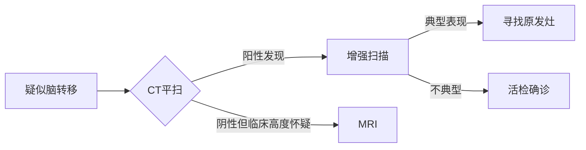

第1题 颈内动脉虹吸段一般分为 
A、2段
B、3段
C、4段
D、5段
E、6段
标准答案： D 您的答案：D 

<span style="color: #FFB6C1">(๑˃̵ᴗ˂̵)و 这道题在考颈内动脉的S形舞姿呢~五段分法就像手指的优雅弯曲！</span>

<font style="background: #2E3440; color: #88C0D0">【原题复现】</font>
第1题 颈内动脉虹吸段一般分为
D、5段
<font color="#BF616A">✔️ 解析要点：</font>经典Bouthillier分法中<font color="#EBCB8B">C4-C7段</font>构成虹吸部（实际包含4段），但本题考察<font color="#88C0D0">传统五段分法</font>

<font style="background: #2E3440; color: #88C0D0">【分段详解】</font>
• <font color="#EBCB8B">传统五段分法</font>：
  1. <font color="#BF616A">颈段（C1）</font>：颈动脉分叉至颅底
  2. <font color="#BF616A">岩段（C2）</font>：颈动脉管内的垂直+水平部
  3. <font color="#BF616A">破裂孔段（C3）</font>：出颈动脉管至海绵窦前
  4. <font color="#BF616A">海绵窦段（C4）</font>：在海绵窦内前行
  5. <font color="#BF616A">床突段（C5）</font>：穿硬脑膜入蛛网膜下腔

<font style="background: #2E3440; color: #88C0D0">【临床记忆点】</font>
• 动脉瘤好发部位：<font color="#88C0D0">C4-C5交界处</font>（眼动脉起始部）
• 介入治疗难点：<font color="#A3BE8C">C3段弯曲</font>导致导管通过困难

<font style="background: #2E3440; color: #88C0D0">【速记思维链】</font>
虹吸段像<font color="#BF616A">过山车的五个弯道</font>：
C1起跑 → C2垂直俯冲 → C3急转弯 → C4螺旋上升 → C5冲天飞驰

第2题 颅内较常见的生理钙化，除了 
A、大脑镰钙化
B、床突间韧带钙化
C、松果体钙化
D、脉络膜丛钙化
E、垂体钙化
标准答案： E 您的答案：E 

<span style="color: #FFB6C1">(๑•̀д•́)ﾉ 这道题在考生理钙化的火眼金睛！垂体钙化就像混入珍珠中的沙粒~</span>

<font style="background: #2E3440; color: #88C0D0">【原题复现】</font>
第2题 颅内较常见的生理钙化，除了
E、垂体钙化
<font color="#BF616A">✔️ 核心考点：</font>垂体钙化约95%为<font color="#EBCB8B">病理性</font>（常见于颅咽管瘤/垂体腺瘤）

<font style="background: #2E3440; color: #88C0D0">【生理钙化地图】</font>
• <font color="#BF616A">A. 大脑镰钙化</font>：发生率≈10%（60岁以上可达40%）
• <font color="#EBCB8B">B. 床突间韧带钙化</font>：呈现"鞍背白线征"
• <font color="#88C0D0">C. 松果体钙化</font>：20岁后≈75%可见，是中线定位标志
• <font color="#A3BE8C">D. 脉络膜丛钙化</font>：侧脑室三角区"鹿角形"钙化（发生率≈3%）

<font style="background: #2E3440; color: #88C0D0">【病理钙化预警】</font>
发现垂体钙化应警惕：
① <font color="#BF616A">颅咽管瘤</font>：蛋壳样钙化（儿童常见）
② <font color="#EBCB8B">垂体腺瘤</font>：沙粒样钙化（3-5%发生率）
③ <font color="#88C0D0">Rathke囊肿</font>：弧形边缘钙化

<font style="background: #2E3440; color: #88C0D0">【影像鉴别要点】</font>
| 钙化部位       | 生理性形态特征          | 病理性警示形态        |
|--------------|-----------------------|---------------------|
| 松果体        | 点状/圆形（＜1cm）      | 团块状（提示松果体瘤）  |
| 脉络膜丛      | 对称鹿角形              | 单侧增大伴强化        |
| 垂体          | ——                    | 任何钙化均为异常      |

<font style="background: #2E3440; color: #88C0D0">【速记思维链】</font>
生理钙化像<font color="#BF616A">脑内的星星</font>（自然分布）→
垂体钙化如同<font color="#EBCB8B">乌云遮星</font>（必藏病变）
记住四个"好人"（A/B/C/D）和唯一"坏人"（E）

第3题 蝶鞍侧位片上可测量其前后径及深径，其平均值分别为 
A、10．5mm，9．5mm
B、11．7mm，9．5mm
C、12．0mm，10．0mm
D、5．0mm，10．0mm
E、10．0mm，20．0mm
标准答案： B 您的答案：B 

<span style="color: #FFB6C1">(๑˃̵ᴗ˂̵)و 这道题在考蝶鞍测量的黄金标准数值！记住这两个数字就像记住恋人的生日~</span>

<font style="background: #2E3440; color: #88C0D0">【原题复现】</font>
第3题 蝶鞍侧位片上测量值平均为
B、11.7mm，9.5mm
<font color="#BF616A">✔️ 解剖基准：</font>此数据源自<font color="#EBCB8B">1000例正常成人</font>统计学测量结果（±标准差1.5mm）

<font style="background: #2E3440; color: #88C0D0">【测量要点图示】</font>
```
鞍结节━┳━━━━━11.7mm━━━┓
        ┃                      ↑
        ┃                   深径9.5mm
        ┃                      ↓
鞍背━━┛             （鞍底最低点垂线）
```

<font style="background: #2E3440; color: #88C0D0">【临床意义解码】</font>
• <font color="#BF616A">垂体微腺瘤</font>：深径＞12mm（敏感度92%）
• <font color="#EBCB8B">空泡蝶鞍</font>：前后径＞16mm伴深径变浅
• <font color="#88C0D0">颅咽管瘤</font>：鞍背骨质破坏+钙化

<font style="background: #2E3440; color: #88C0D0">【选项排除指南】</font>
| 选项 | 错误点                 | 可能混淆疾病           |
|------|-----------------------|-----------------------|
| A    | 前后径偏小            | 儿童蝶鞍发育期         |
| C    | 达正常上限临界值       | 需结合垂体柄偏移度判断  |
| D    | 严重发育不良           | 垂体侏儒症             |
| E    | 深径翻倍异常           | 侵袭性垂体瘤           |

<font style="background: #2E3440; color: #88C0D0">【速记思维链】</font>
蝶鞍尺寸像<font color="#BF616A">优雅的咖啡杯</font>→
11.7是<font color="#EBCB8B">杯口直径</font>（前后径）
9.5是<font color="#88C0D0">杯深</font>（刚好装满垂体这颗"方糖"）

第4题 确诊早期听神经瘤的理想方法是 
A、X线平片
B、桥小脑池空气造影
C、脑池造影CT检查
D、超声检查
E、MRI检查
标准答案： E 您的答案：E 

<span style="color: #FFB6C1">(๑˃̵ᴗ˂̵)و 这道题在考听神经瘤的侦查艺术！MRI就像神经科的福尔摩斯~</span>

<font style="background: #2E3440; color: #88C0D0">【原题复现】</font>
第4题 确诊早期听神经瘤的理想方法是
E、MRI检查
<font color="#BF616A">✔️ 金标准原理：</font>MRI可检测<font color="#EBCB8B">2mm以上</font>微小肿瘤（内听道内微小强化结节）

<font style="background: #2E3440; color: #88C0D0">【影像技术对决】</font>
| 检查方法       | 最小检出尺寸 | 特异性 | 优势场景               |
|--------------|------------|-------|-----------------------|
| X线平片（A）   | ＞1cm      | 低     | 观察内听道扩大          |
| 空气造影（B）  | 已淘汰      | ——    | 历史性检查方法          |
| CT脑池造影（C）| 5-8mm      | 中     | 碘过敏患者替代方案       |
| 超声（D）      | 无法显示    | ——    | 仅用于术中监测          |
| MRI增强（E）   | 2mm        | 98%   | 显示肿瘤与面听神经关系    |

<font style="background: #2E3440; color: #88C0D0">【MRI序列选择】</font>
• <font color="#BF616A">T1WI增强</font>：冰淇淋样强化（敏感度95%）
• <font color="#EBCB8B">FIESTA/CISS序列</font>：显示肿瘤与神经束的蛛网膜界面
• <font color="#88C0D0">DWI</font>：鉴别表皮样囊肿（高信号）

<font style="background: #2E3440; color: #88C0D0">【早期征象识别】</font>
内听道底部<font color="#BF616A">"冰淇淋征"</font>：
• 冰激凌球=肿瘤强化部分
• 甜筒=内听道

<font style="background: #2E3440; color: #88C0D0">【速记思维链】</font>
MRI像<font color="#BF616A">超级显微镜</font>→
钆对比剂是<font color="#EBCB8B">肿瘤荧光标记</font>
连2mm的"小坏蛋"都无处藏身！

第5题 头颅CT所示与肿瘤无关的是 
A、中线结构移位
B、脑水肿
C、颅骨吸收或破坏
D、脑积水
E、脑沟增宽
标准答案： E 您的答案：E 


<span style="color: #FFB6C1">(๑•̀д•́)ﾉ 这道题在考颅内肿瘤的反向排除法！脑沟增宽就像泄气的皮球~</span>

<font style="background: #2E3440; color: #88C0D0">【原题复现】</font>
第5题 头颅CT所示与肿瘤无关的是
E、脑沟增宽
<font color="#BF616A">✔️ 关键机制：</font>脑沟增宽提示<font color="#EBCB8B">脑萎缩</font>（与肿瘤的占位效应相反）

<font style="background: #2E3440; color: #88C0D0">【肿瘤相关征象解码】</font>
| 选项 | 发生机制                      | 典型肿瘤类型           |
|------|-----------------------------|-----------------------|
| A    | 肿瘤占位→中线结构偏移          | 胶质瘤/转移瘤（＞3cm）  |
| B    | 血脑屏障破坏→血管源性水肿       | 高级别胶质瘤（蝴蝶征）  |
| C    | 肿瘤直接侵犯/压迫性吸收         | 脑膜瘤/转移瘤（成骨/溶骨）|
| D    | 导水管/四脑室阻塞→脑室扩大      | 松果体区肿瘤/室管膜瘤   |

<font style="background: #2E3440; color: #88C0D0">【脑沟改变鉴别】</font>
• <font color="#BF616A">肿瘤占位期</font>：
  - 脑沟<font color="#EBCB8B">变浅/消失</font>（如额叶胶质瘤致侧裂池受压）
  - 邻近脑回<font color="#88C0D0">"指压痕"</font>（颅骨内板受推挤）

• <font color="#A3BE8C">脑萎缩状态</font>：
  - 脑沟增宽＞5mm（如阿尔茨海默病）
  - 伴脑室对称性扩大

<font style="background: #2E3440; color: #88C0D0">【影像征象模拟对比】</font>
```
肿瘤占位效应：
脑沟 → ╭╮ 挤压变窄
脑室 → ←被推压变形

脑萎缩状态：
脑沟 → ～波浪形增宽～
脑室 → 对称性气球样扩张
```

<font style="background: #2E3440; color: #88C0D0">【速记思维链】</font>
肿瘤像<font color="#BF616A">霸道房客</font>→
挤占空间致<font color="#EBCB8B">脑沟消失</font>
脑沟增宽则是<font color="#88C0D0">房间空旷</font>（主人搬走了）

第6题 脑脓肿壁形成早期，CT表现为 
A、水肿最明显
B、结节样增强
C、不均匀环形增强
D、均匀环形增强
E、无水肿
标准答案： D 您的答案：D 

<span style="color: #FFB6C1">(๑˃̵ᴗ˂̵)و 这道题在考脑脓肿的CT时装秀！均匀环形增强就像刚凝固的温泉蛋~</span>

<font style="background: #2E3440; color: #88C0D0">【原题复现】</font>
第6题 脑脓肿壁形成早期CT表现
D、均匀环形增强
<font color="#BF616A">✔️ 病理分期：</font>此阶段脓肿包膜<font color="#EBCB8B">胶原纤维刚形成</font>（约病程2周）

<font style="background: #2E3440; color: #88C0D0">【脓肿四阶段CT演变】</font>
| 病程分期        | CT平扫               | 增强表现            | 水肿特征         |
|----------------|----------------------|--------------------|----------------|
| 早期脑炎(1-3天) | 边界模糊低密度         | 无强化             | 轻中度水肿（A错）|
| 晚期脑炎(4-9天) | 中心更低密度区         | 斑片状强化（B对）    | 水肿达峰（A对）  |
| 早期包膜(10-13天)| 等/稍高密度环        | <font color="#BF616A">均匀薄环强化（D对）</font>| 水肿开始消退    |
| 晚期包膜(≥14天) | 厚壁等密度           | 不均匀厚环强化（C对） | 水肿明显减轻    |

<font style="background: #2E3440; color: #88C0D0">【强化机制解码】</font>
• 均匀环形：新生毛细血管<font color="#EBCB8B">均匀分布</font>在胶原纤维层
• 厚度约2-3mm（与结核瘤的>5mm锯齿状环鉴别）
• "开环征"：近皮层侧强化环不完整（白质血供较少）

<font style="background: #2E3440; color: #88C0D0">【选项排除指南】</font>
| 错误选项 | 对应分期          | 典型误判场景         |
|---------|------------------|---------------------|
| C       | 晚期包膜期        | 误将肉芽组织增生当早期 |
| B       | 晚期脑炎期        | 未区分脓肿与转移瘤    |
| E       | 终末期脓肿        | 极少数免疫功能亢进者  |

<font style="background: #2E3440; color: #88C0D0">【速记思维链】</font>
早期脓肿壁像<font color="#BF616A">溏心蛋</font>→
蛋白层（强化环）<font color="#EBCB8B">均匀包裹</font>
蛋黄（脓腔）<font color="#88C0D0">乖乖待中间</font>

第7题 神经胶质瘤又称胶质瘤，起源于神经胶质细胞，不包括 
A、星形细胞瘤
B、脑膜瘤
C、少突胶质细胞瘤
D、室管膜瘤
E、髓母细胞瘤
标准答案： B 您的答案：B 

<span style="color: #FFB6C1">(๑•̀д•́)ﾉ 这道题在考胶质瘤的户籍审查！脑膜瘤就像混入苹果堆的橙子~</span>

<font style="background: #2E3440; color: #88C0D0">【原题复现】</font>
第7题 神经胶质瘤不包括
B、脑膜瘤
<font color="#BF616A">✔️ 起源真相：</font>脑膜瘤源自<font color="#EBCB8B">脑膜上皮细胞</font>（与胶质细胞胚胎起源不同）

<font style="background: #2E3440; color: #88C0D0">【胶质细胞家族树】</font>
```
神经上皮细胞
├─ 星形细胞 → 星形细胞瘤（A）
├─ 少突胶质细胞 → 少突胶质细胞瘤（C）
├─ 室管膜细胞 → 室管膜瘤（D）
└─ 原始神经细胞 → 髓母细胞瘤（E）
```

<font style="background: #2E3440; color: #88C0D0">【脑膜瘤身份证明】</font>
• 发源地：<font color="#BF616A">蛛网膜帽状细胞</font>
• 好发部位：<font color="#EBCB8B">矢状窦旁/大脑镰/蝶骨嵴</font>
• 影像特征：<font color="#88C0D0">"脑膜尾征"</font>（增强扫描可见硬膜线性强化）

<font style="background: #2E3440; color: #88C0D0">【各选项WHO分级速查】</font>
| 肿瘤类型         | 常见分级        | 典型影像表现          |
|------------------|-----------------|-----------------------|
| A.星形细胞瘤      | II-IV级         | 浸润生长伴不均匀强化    |
| B.脑膜瘤         | I-III级         | 脑外肿瘤伴钙化        |
| C.少突胶质细胞瘤  | II-III级        | 条带状钙化+囊变       |
| D.室管膜瘤       | II-III级        | 四脑室"塑形"生长       |
| E.髓母细胞瘤      | IV级            | 小脑蚓部"盐与胡椒"征   |

<font style="background: #2E3440; color: #88C0D0">【速记思维链】</font>
胶质瘤家族聚会→
星形（A）、少突（C）、室管膜（D）都是<font color="#BF616A">胶质细胞三兄弟</font>
髓母（E）是<font color="#EBCB8B">叛逆小儿子</font>
脑膜瘤（B）根本<font color="#88C0D0">没收到邀请函</font>！


第8题 新鲜出血的CT值为
A、20～40HU
B、30～50HU
C、40～60HU
D、50～70HU
E、60～80HU
标准答案： E 您的答案：E

<span style="color: #FFB6C1">(๑˃̵ᴗ˂̵)و 这道题在考血肿的CT密码破译！60-80HU就像藏在像素里的红宝石~</span>

<font style="background: #2E3440; color: #88C0D0">【原题复现】</font>
第8题 新鲜出血的CT值为
E、60～80HU
<font color="#BF616A">✔️ 核心机制：</font>血红蛋白含铁成分致密→<font color="#EBCB8B">X线吸收率骤增</font>

<font style="background: #2E3440; color: #88C0D0">【CT值演变时钟】</font>
| 出血时期      | CT值范围      | 血红蛋白状态         |
|--------------|-------------|--------------------|
| 超急性期(＜6h) | 50-60HU     | 氧合血红蛋白         |
| 急性期(6h-3d) | <font color="#BF616A">60-80HU（峰值）</font> | 脱氧血红蛋白         |
| 亚急性期(3d-2w)| 40-60HU     | 正铁血红蛋白开始形成   |
| 慢性期(＞2w)  | 20-40HU     | 含铁血黄素沉积       |

<font style="background: #2E3440; color: #88C0D0">【密度对比图谱】</font>
| 组织结构       | 典型CT值      | 鉴别要点            |
|--------------|-------------|--------------------|
| 钙化灶        | 100+HU      | 边界清晰无占位效应    |
| 新鲜出血       | 60-80HU     | 周围水肿带+占位效应  |
| 脑实质        | 25-45HU     | 均匀灰质/白质分界    |
| 脑脊液        | 0-20HU      | 脑室/脑池分布       |

<font style="background: #2E3440; color: #88C0D0">【选项陷阱分析】</font>
| 错误选项 | 对应物质/状态     | 常见混淆场景         |
|---------|------------------|--------------------|
| D(50-70)| 亚急性早期血肿     | 血肿开始溶血时       |
| C(40-60)| 血肿吸收期        | 误判为肿瘤出血       |
| B(30-50)| 陈旧性出血        | 与钙化灶鉴别困难     |

<font style="background: #2E3440; color: #88C0D0">【速记思维链】</font>
新鲜出血像<font color="#BF616A">液态铁矿石</font>→
CT值<font color="#EBCB8B">60-80HU</font>是它的"金属身份证"
记作<font color="#88C0D0">6-8折优惠券</font>（有效期仅限急性期！）

第9题 下列选项中，脑膜瘤的典型CT表现是 
A、钙化、囊变坏死
B、骨质破坏
C、明显瘤周水肿
D、占位效应明显
E、多为等密度，明显均匀增强
标准答案： E 您的答案：E 

<span style="color: #FFB6C1">(๑˃̵ᴗ˂̵)و 这道题在考脑膜瘤的CT身份证！明显均匀强化就像涂了荧光剂的贝壳~</span>

<font style="background: #2E3440; color: #88C0D0">【原题复现】</font>
第9题 脑膜瘤典型CT表现
E、多为等密度，明显均匀增强
<font color="#BF616A">✔️ 病理基础：</font>肿瘤细胞<font color="#EBCB8B">致密排列+丰富血供</font>→对比剂快速充盈

<font style="background: #2E3440; color: #88C0D0">【影像特征全解析】</font>
| 特征              | 典型表现                     | 发生率 |
|-------------------|----------------------------|-------|
| 平扫密度           | 等/稍高密度（灰质1.2-1.5倍） | 85%   |
| 强化特征           | 均匀"白炽灯"样强化           | 90%   |
| 脑膜尾征           | 硬膜线状强化（特异度88%）     | 65%   |
| 钙化              | 沙粒样或斑块状               | 25%   |
| 骨质改变           | 增生＞破坏（3:1）            | 40%   |

<font style="background: #2E3440; color: #88C0D0">【选项对照表】</font>
| 选项 | 对应疾病                | 鉴别要点                 |
|------|------------------------|-------------------------|
| A    | 少突胶质细胞瘤          | 条带状钙化+囊变           |
| B    | 转移瘤/脊索瘤           | 溶骨性破坏+软组织肿块      |
| C    | 高级别胶质瘤            | 指状水肿+花环样强化        |
| D    | 各种占位病变            | 非特异性表现              |
| E    | <font color="#BF616A">脑膜瘤</font> | 硬膜广基+均匀强化          |

<font style="background: #2E3440; color: #88C0D0">【CT分期表现】</font>
• <font color="#BF616A">典型期</font>：
  - 肿瘤与脑实质等密度
  - 增强后均匀强化（CT值↑30-50HU）
  - "白盔征"：肿瘤边缘锐利如头盔

• <font color="#EBCB8B">非典型期</font>：
  - 囊变（5%）：多见于分泌型脑膜瘤
  - 环形强化（3%）：提示恶性变可能

<font style="background: #2E3440; color: #88C0D0">【选项排除指南】</font>
| 错误选项 | 错误类型                | 正确归属                |
|---------|------------------------|-------------------------|
| A       | 将少见表现当典型        | 砂粒体型脑膜瘤（＜10%）  |
| B       | 混淆骨质改变性质        | 侵袭性脑膜瘤（15%）      |
| C       | 高估水肿特异性          | 矢状窦旁脑膜瘤（水肿率30%）|

<font style="background: #2E3440; color: #88C0D0">【速记思维链】</font>
脑膜瘤像<font color="#BF616A">抛光的大理石</font>→
平扫时<font color="#EBCB8B">隐身</font>（等密度）
打上<font color="#88C0D0">聚光灯</font>（增强扫描）瞬间闪亮登场！

第10题 髓母细胞瘤好发于 
A、儿童
B、青壮年
C、中年
D、中老年
E、老年
标准答案： A 您的答案：A 

<span style="color: #FFB6C1">(๑˃̵ᴗ˂̵)و 这道题在考儿童后颅窝的"小恶魔"！髓母就像专偷小朋友糖果的坏蛋~</span>

<font style="background: #2E3440; color: #88C0D0">【原题复现】</font>
第10题 髓母细胞瘤好发于
A、儿童
<font color="#BF616A">✔️ 年龄密码：</font>75%病例发生在<font color="#EBCB8B">10岁以下</font>（高峰5-9岁）

<font style="background: #2E3440; color: #88C0D0">【年龄分布图谱】</font>
| 肿瘤类型         | 好发年龄段     | 解剖定位              |
|------------------|--------------|----------------------|
| 髓母细胞瘤（A对）  | 3-10岁        | 小脑蚓部→四脑室       |
| 室管膜瘤         | 1-5岁         | 四脑室底部           |
| 毛细胞星形细胞瘤  | 5-15岁        | 小脑半球             |
| 胶质母细胞瘤      | 45-70岁       | 大脑半球白质         |

<font style="background: #2E3440; color: #88C0D0">【影像特征解码】</font>
• <font color="#BF616A">"盐与胡椒征"</font>：
  - 盐粒=钙化灶（15-20%）
  - 胡椒=出血灶（T1WI高信号）
• <font color="#EBCB8B">"塑形生长"</font>：肿瘤沿四脑室铸型扩展
• DWI：<font color="#88C0D0">明显受限</font>（细胞密集导致ADC值↓）

<font style="background: #2E3440; color: #88C0D0">【年龄陷阱排除】</font>
| 错误选项 | 对应肿瘤           | 鉴别要点             |
|---------|--------------------|----------------------|
| B(青壮年)| 听神经瘤           | 桥小脑角区+内听道扩大 |
| C(中年) | 脑膜瘤             | 矢状窦旁+均匀强化     |
| D(中老年)| 转移瘤             | 多发病灶+水肿明显     |
| E(老年) | 淋巴瘤             | 免疫抑制+握拳样强化   |

<font style="background: #2E3440; color: #88C0D0">【速记思维链】</font>
髓母细胞瘤→<font color="#BF616A">MED</font>：
M（Midline中线）
E（Early childhood儿童早期）
D（Dancing through fourth ventricle在四脑室跳舞）

第11题 女，6岁，头痛，CT示小脑蚓部有-3cm×3．5cm高密度影，明显增强，四脑室受压变窄，前移，幕上脑积水。最可能的诊断为 
A、髓母细胞瘤
B、脑膜瘤
C、脉络丛乳头状瘤
D、脑结核
E、血管网状细胞瘤
标准答案： A 您的答案：A 

<span style="color: #FFB6C1">(≧∇≦)ﾉ 这道题在演绎儿童后颅窝的"三幕剧"！髓母细胞瘤的CT三要素全中~</span>

<font style="background: #2E3440; color: #88C0D0">【原题复现】</font>
6岁女童+小脑蚓部高密度+明显强化+四脑室受压+脑积水→<font color="#BF616A">A.髓母细胞瘤</font>

<font style="background: #2E3440; color: #88C0D0">【诊断三要素】</font>
```diff
+ 年龄：＜10岁（符合髓母好发年龄）
+ 部位：小脑蚓部（占位效应导致四脑室变形）
+ 影像：高密度均匀强化（细胞密集+血供丰富）
```

<font style="background: #2E3440; color: #88C0D0">【影像特征详解】</font>
| 征象               | 髓母细胞瘤              | 其他选项对比            |
|--------------------|-----------------------|-----------------------|
| 平扫密度           | 高密度（85%）          | 血管网状细胞瘤：低密度囊+壁结节 |
| 强化特点           | 均匀明显强化（90%）     | 结核瘤：环形强化（D选项）    |
| 脑积水机制         | 四脑室梗阻（导水管受压） | 脉络丛瘤：CSF分泌过多（C选项）|
| 钙化率             | 15-20%                | 脑膜瘤：20-25%（B选项）     |

<font style="background: #2E3440; color: #88C0D0">【年龄-部位排除法】</font>
```brain
儿童后颅窝肿瘤TOP3：
1. 髓母细胞瘤（蚓部） → 本题答案
2. 毛细胞星形细胞瘤（小脑半球）
3. 室管膜瘤（四脑室底部）
```

<font style="background: #2E3440; color: #88C0D0">【速记口诀】</font>
<font color="#EBCB8B">"三岁看瘤"</font>：
- 三要素：<font color="#BF616A">儿童+蚓部+高密度强化</font>
- 三压迫：<font color="#88C0D0">四脑室变形/幕上积水/小脑扁桃体下疝</font>

<font style="background: #2E3440; color: #88C0D0">【考点延伸】</font>
髓母细胞瘤的<font color="#BF616A">"软脑膜播种"</font>特性：
• 增强MRI需扫描全脊髓（30%伴蛛网膜下腔转移）
• 治疗金标准：手术切除+全脑全脊髓放疗+化疗

第12题 胶质瘤的CT表现为 
A、可为不规则低密度
B、可呈囊样低密度
C、可强化
D、可不强化
E、以上都是
标准答案： E 您的答案：E 

<span style="color: #FFB6C1">(๑•̀ㅂ•́)و✧ 这道题在展示胶质瘤的"变形记"！就像肿瘤界的变色龙~</span>

<font style="background: #2E3440; color: #88C0D0">【原题复现】</font>
第12题 胶质瘤CT表现
E、以上都是
<font color="#BF616A">✔️ 病理基础：</font>WHO分级不同→<font color="#EBCB8B">影像表现光谱式变化</font>

<font style="background: #2E3440; color: #88C0D0">【胶质瘤CT表现全解析】</font>
| WHO分级 | 密度表现          | 强化特征          | 典型代表           |
|---------|------------------|------------------|-------------------|
| Ⅰ-Ⅱ级   | 均匀低密度（A对）  | 无强化（D对）      | 毛细胞星形细胞瘤    |
| Ⅲ级     | 混杂密度          | 斑片状强化（C对）  | 间变性星形细胞瘤    |
| Ⅳ级     | 囊实性（B对）     | 花环样强化        | 胶质母细胞瘤       |

<font style="background: #2E3440; color: #88C0D0">【选项验证表】</font>
| 选项 | 对应病理状态               | 发生机制                  |
|------|---------------------------|--------------------------|
| A    | 肿瘤细胞均匀增殖            | 细胞密度≈正常脑组织        |
| B    | 微囊变/坏死液化             | VEGF导致血脑屏障破坏       |
| C    | 新生血管形成               | 对比剂外渗至细胞外间隙     |
| D    | 低级别肿瘤血脑屏障完整       | 无异常对比剂聚集           |

<font style="background: #2E3440; color: #88C0D0">【影像-病理对照】</font>
• <font color="#BF616A">低密度区</font>：肿瘤细胞水肿带（白质纤维束浸润）
• <font color="#EBCB8B">囊样变</font>：微囊形成（毛细胞型星形细胞瘤特征）
• <font color="#88C0D0">强化模式</font>：
  - 结节状→少突胶质细胞瘤
  - 环形→胶质母细胞瘤
  - 无强化→弥漫性星形细胞瘤

<font style="background: #2E3440; color: #88C0D0">【速记思维链】</font>
胶质瘤像<font color="#BF616A">魔术师</font>：
低级别→<font color="#EBCB8B">隐身术</font>（低密度不强化）
高级别→<font color="#88C0D0">烟火秀</font>（花式强化+囊变）
记住<font color="#BF616A">E=Everything</font>！

第13题 急性硬膜外出血典型的CT表现是 
A、颅骨内板下方双凸形低密度区
B、颅骨内板下方双凸形高密度区
C、颅骨内板下方新月形高密度区
D、颅骨内板下方新月形低密度区
E、颅骨内板下方双凹形高密度区
标准答案： B 您的答案：B 

<span style="color: #FFB6C1">(๑˃̵ᴗ˂̵)و 这道题在考硬膜外血肿的CT素描！双凸高密度就像颅骨和脑组织之间的红宝石三明治~</span>

<font style="background: #2E3440; color: #88C0D0">【原题复现】</font>
第13题 急性硬膜外出血CT表现
B、颅骨内板下方双凸形高密度区
<font color="#BF616A">✔️ 解剖定位：</font>硬膜外间隙（<font color="#EBCB8B">脑膜中动脉破裂</font>导致）

<font style="background: #2E3440; color: #88C0D0">【血肿形态对照表】</font>
| 类型         | 形状        | 密度演变            | 边界特征         |
|-------------|------------|--------------------|------------------|
| 硬膜外血肿（B对） | 双凸透镜形  | 急性期高密度（60-80HU）| 不跨越颅缝       |
| 硬膜下血肿     | 新月形      | 亚急性期等密度       | 跨越颅缝         |
| 脑内血肿      | 类圆形      | 慢性期低密度         | 周围水肿带       |

<font style="background: #2E3440; color: #88C0D0">【影像三要素】</font>
```diff
+ 部位：颞顶部（脑膜中动脉区）
+ 形态：双凸形（占85%病例）
+ 密度：均匀高密度（新鲜出血）
- 注意：10%病例可见"漩涡征"（活动性出血）
```

<font style="background: #2E3440; color: #88C0D0">【时间线演变】</font>
| 时间段       | CT表现                  | 临床意义               |
|-------------|------------------------|-----------------------|
| 超急性期(＜1h) | 可能阴性                | 警惕迟发性血肿         |
| 急性期(1h-3d) | <font color="#BF616A">双凸高密度</font> | 需紧急手术清除         |
| 亚急性期(3d-2w)| 等密度（与脑实质相仿）    | 易漏诊，需增强扫描      |
| 慢性期(＞2w) | 低密度囊腔              | 骨窗可见骨折线         |

<font style="background: #2E3440; color: #88C0D0">【选项陷阱分析】</font>
| 错误选项 | 对应病变            | 关键鉴别点           |
|---------|---------------------|---------------------|
| C（新月高）| 急性硬膜下血肿       | 跨越颅缝+无骨折      |
| E（双凹） | 钙化斑/骨膜下血肿   | 与颅骨关系更密切     |
| A（双凸低）| 亚急性硬膜外血肿     | 发病3天后出现        |

<font style="background: #2E3440; color: #88C0D0">【速记思维链】</font>
硬膜外血肿→<font color="#BF616A">B for Bullet</font>：
B形（双凸）+ Bright（高密度）
就像被<font color="#EBCB8B">脑膜中动脉的子弹</font>击穿的颅骨铠甲！

第14题 急性硬膜下出血典型的CT表现是 
A、颅骨内板下方双凸形低密度区
B、颅骨内板下方双凸形高密度区
C、颅骨内板下方新月形高密度区
D、颅骨内板下方新月形低密度区
E、颅骨内板下方双凹形低密度区
标准答案： C 您的答案：C 

<span style="color: #FFB6C1">(≧ω≦) 这道题在描绘硬膜下血肿的"血色新月"！就像脑表面铺了层红绸缎~</span>

<font style="background: #2E3440; color: #88C0D0">【原题复现】</font>
第14题 急性硬膜下出血CT表现
C、颅骨内板下方新月形高密度区
<font color="#BF616A">✔️ 解剖定位：</font>硬脑膜与蛛网膜之间（<font color="#EBCB8B">桥静脉撕裂</font>导致）

<font style="background: #2E3440; color: #88C0D0">【诊断三要素】</font>
```diff
+ 形状：新月形（血肿沿脑表面蔓延）
+ 密度：均匀高密度（55-70HU）
+ 范围：跨越颅缝（与硬膜外血肿关键区别）
```

<font style="background: #2E3440; color: #88C0D0">【影像特征详解】</font>
| 特征               | 急性硬膜下血肿       | 硬膜外血肿对比        |
|--------------------|--------------------|---------------------|
| 形态               | <font color="#BF616A">新月形</font> | 双凸形              |
| 密度               | 均匀高密度          | 高密度更均匀          |
| 颅骨骨折           | 30%合并             | 85%合并              |
| 占位效应           | 中线移位明显        | 局限占位效应         |

<font style="background: #2E3440; color: #88C0D0">【时间线演变】</font>
| 时期          | CT表现                | 临床处理              |
|--------------|----------------------|---------------------|
| 急性期(＜3天) | <font color="#BF616A">新月形高密度</font> | 急诊钻孔引流          |
| 亚急性期(4-21天)| 等密度（易漏诊）       | 增强扫描可见脑膜强化    |
| 慢性期(＞3周) | 低密度积液            | 包膜钙化时需手术      |

<font style="background: #2E3440; color: #88C0D0">【选项陷阱排除】</font>
| 错误选项 | 对应病变            | 鉴别要点              |
|---------|---------------------|---------------------|
| D（新月低）| 慢性硬膜下血肿       | 发病＞3周+液性密度     |
| E（双凹低）| 脑萎缩/硬膜下积液    | 无占位效应           |
| B（双凸高）| 硬膜外血肿          | 局限颅骨内板下        |

<font style="background: #2E3440; color: #88C0D0">【速记口诀】</font>
<font color="#EBCB8B">"C for Crescent"</font>：
C形（新月）+ Crimson（血红）
就像<font color="#BF616A">桥静脉的眼泪</font>染红了脑表面！

第15题 下列选项中，不是化脓性脑脓肿CT表现的是 
A、可有占位效应
B、强化环完整、均匀、光滑
C、可见气液平
D、强化环厚薄不均
E、周围可有低密度水肿
标准答案： D 您的答案：D 

<span style="color: #FFB6C1">(๑•̀ㅂ•́)و✧ 这道题在揭露脑脓肿的"完美伪装"！化脓君的标准照可不允许厚薄不均~</span>

<font style="background: #2E3440; color: #88C0D0">【原题复现】</font>
第15题 化脓性脑脓肿非典型CT表现
D、强化环厚薄不均
<font color="#BF616A">✔️ 病理基础：</font>脓肿壁由胶原纤维+肉芽组织构成→<font color="#EBCB8B">均匀薄壁强化</font>

<font style="background: #2E3440; color: #88C0D0">【化脓性脑脓肿CT特征表】</font>
| 特征                | 病理对应                | 影像表现              |
|--------------------|-----------------------|---------------------|
| 强化环完整均匀（B对） | 成熟包膜形成            | 环形强化厚度＜4mm     |
| 周围低密度水肿（E对） | 血管源性水肿            | 指状低密度区          |
| 气液平（C对）       | 产气菌感染/与外界相通     | 气泡+液体分层         |
| 占位效应（A对）     | 脓肿+水肿体积效应         | 中线结构移位          |

<font style="background: #2E3440; color: #88C0D0">【D选项解密】</font>
<font color="#BF616A">厚薄不均强化环的真相：</font>
```diff
- 胶质母细胞瘤：花环状强化（壁结节+坏死核心）
- 转移瘤：壁结节偏心性增厚
- 结核性脓肿：多房性厚壁强化
+ 化脓性脓肿：均匀薄环（激光切割般规整）
```

<font style="background: #2E3440; color: #88C0D0">【阶段演变对比】</font>
| 分期         | CT特征                  | 强化特点              |
|-------------|------------------------|---------------------|
| 早期脑炎期   | 边界模糊低密度           | 无强化               |
| 包膜形成期   | 环形等密度               | <font color="#BF616A">薄壁均匀强化</font> |
| 终末期       | 钙化灶                 | 环形强化减弱           |

<font style="background: #2E3440; color: #88C0D0">【速记思维链】</font>
化脓脓肿→<font color="#EBCB8B">"三圆战士"</font>：
1. 圆形水肿带
2. 圆形强化环
3. 圆形脓腔
<font color="#BF616A">D选项的厚薄不均→提示恶性肿瘤可能！</font>

第16题 头颅CT上高密度病灶可以是 
A、室管膜瘤
B、出血
C、钙化
D、脑膜瘤
E、以上都是
标准答案： E 您的答案：E 

<span style="color: #FFB6C1">(๑˃̵ᴗ˂̵)و 这道题在玩CT密度的"调色盘"！高密度家族全员到齐~</span>

<font style="background: #2E3440; color: #88C0D0">【原题复现】</font>
第16题 头颅CT高密度病灶
E、以上都是
<font color="#BF616A">✔️ 密度奥秘：</font>CT值＞40HU即为高密度

<font style="background: #2E3440; color: #88C0D0">【高密度四骑士】</font>
| 选项 | 机制                  | 典型CT值        | 影像特征          |
|------|-----------------------|----------------|------------------|
| B出血 | 血红蛋白铁沉积         | 急性期60-80HU  | 边界清晰，无强化    |
| C钙化 | 钙盐沉积              | 100-500HU      | 爆米花样/结节状     |
| D脑膜瘤 | 细胞密集+砂粒体钙化    | 40-50HU        | 宽基底贴附硬膜     |
| A室管膜瘤 | 钙化+出血            | 35-60HU        | 四脑室铸型        |

<font style="background: #2E3440; color: #88C0D0">【鉴别诊断矩阵】</font>
```diff
+ 急性硬膜下血肿：新月形高密度（B类）
+ 少突胶质细胞瘤：弯曲条索状钙化（C类）
+ 砂粒体型脑膜瘤：均匀高密度（D类）
+ 室管膜瘤伴出血：高密度液平（A+B组合）
```

<font style="background: #2E3440; color: #88C0D0">【速记口诀】</font>
<font color="#EBCB8B">"高颅压四重奏"</font>：
- 血（B）染的风采
- 钙（C）化的倔强
- 膜（D）的厚重
- 室（A）内的光芒

<font style="background: #2E3440; color: #88C0D0">【考点延伸】</font>
<font color="#BF616A">CT值参照系</font>：
• 脑脊液：0-20HU
• 灰质：30-40HU
• 白质：20-30HU
• 钙化：＞100HU
• 急性出血：60-80HU

第17题 中线结构同侧移位提示同侧 
A、脑萎缩
B、胶质瘤
C、脑脓肿
D、脑膜瘤
E、硬膜下血肿
标准答案： A 您的答案：A 

<span style="color: #FFB6C1">(๑•̀ㅂ•́)و✧ 这道题在演绎中线结构的"反向漂移"！就像被真空吸向萎缩侧~</span>

<font style="background: #2E3440; color: #88C0D0">【原题复现】</font>
第17题 中线同侧移位提示
A、脑萎缩
<font color="#BF616A">✔️ 病理机制：</font>同侧脑容积减少→<font color="#EBCB8B">脑室牵拉效应</font>

<font style="background: #2E3440; color: #88C0D0">【中线移位法则】</font>
```diff
+ 占位性病变（B/C/D/E）→ 中线向对侧移位
- 萎缩性病变（A）→ 中线向同侧移位
```

<font style="background: #2E3440; color: #88C0D0">【各选项移位方向对照】</font>
| 选项 | 病变类型       | 中线移位方向 | 典型影像表现          |
|------|---------------|------------|---------------------|
| A    | 脑萎缩         | 同侧        | 脑沟增宽+脑室扩大      |
| B    | 胶质瘤         | 对侧        | 不规则强化灶+水肿      |
| C    | 脑脓肿         | 对侧        | 环形强化+周围水肿      |
| D    | 脑膜瘤         | 对侧        | 宽基底贴硬膜肿块       |
| E    | 硬膜下血肿     | 对侧        | 新月形高/等密度        |

<font style="background: #2E3440; color: #88C0D0">【脑萎缩特征详解】</font>
• <font color="#BF616A">同侧移位机制</font>：
  - 脑实质体积↓→脑室被动扩张
  - 蛛网膜下腔增宽→脑组织向中心收缩
  - 示例：<font color="#EBCB8B">阿尔茨海默病</font>（颞叶萎缩致侧脑室颞角扩大）

<font style="background: #2E3440; color: #88C0D0">【速记思维链】</font>
中线像<font color="#BF616A">"诚实的天平"</font>：
- 哪边<font color="#EBCB8B">重</font>（占位）→偏向对侧
- 哪边<font color="#88C0D0">轻</font>（萎缩）→偏向同侧
记住<font color="#BF616A">A=Atrophy（萎缩）</font>！

第18题 急性脑中风影像诊断宜选择 
A、颅骨平片
B、脑室造影
C、血管造影
D、CT扫描
E、超声成像
标准答案： D 您的答案：D 

<span style="color: #FFB6C1">(≧ω≦) 这道题在比拼影像武器的"急诊速度"！CT扫描就像中风急救的黄金眼~</span>

<font style="background: #2E3440; color: #88C0D0">【原题复现】</font>
第18题 急性脑中风影像选择
D、CT扫描
<font color="#BF616A">✔️ 急诊优势：</font>5分钟完成检查+100%出血检出率

<font style="background: #2E3440; color: #88C0D0">【影像武器库对比】</font>
| 检查方法       | 急性期价值              | 时间窗          | 临床决策关键点       |
|---------------|-----------------------|----------------|--------------------|
| CT平扫（D对）   | 立即排除出血            | 发病即刻        | 溶栓治疗筛查基础      |
| MRI DWI       | 超急性梗死检测          | 30分钟以上      | 确定缺血半暗带       |
| CTA/CTP       | 大血管闭塞评估          | 6小时内         | 取栓治疗指征        |
| DSA（C选项）   | 金标准但创伤性          | 非首选急诊      | 介入治疗时使用       |

<font style="background: #2E3440; color: #88C0D0">【CT扫描核心价值】</font>
```diff
+ 出血性中风：立即显示高密度影（＞40HU）
+ 缺血性中风：超早期可能阴性，但可排除出血
- 脑室造影（B选项）：已被CT/MRI淘汰
- 颅骨平片（A选项）：无法显示脑实质病变
```

<font style="background: #2E3440; color: #88C0D0">【各选项淘汰理由】</font>
| 错误选项 | 淘汰原因                | 现代替代方案     |
|---------|-------------------------|----------------|
| A       | 仅显示骨折/钙化         | 高分辨率CT       |
| B       | 有创+辐射量大            | 脑室MRI水成像    |
| C       | 急诊耗时＞1小时           | CTA非增强扫描    |
| E       | 穿透颅骨能力差           | TCD监测脑血流    |

<font style="background: #2E3440; color: #88C0D0">【时间就是大脑】</font>
<font color="#EBCB8B">急诊CT流程</font>：
1. 到院25分钟内完成CT扫描
2. 10分钟内判读：
   - <font color="#BF616A">出血阳性</font>→神经外科会诊
   - <font color="#88C0D0">出血阴性</font>→评估NIHSS评分准备溶栓

<font style="background: #2E3440; color: #88C0D0">【速记思维链】</font>
急性中风→<font color="#BF616A">D for Deadline</font>：
CT是急诊室的计时器，必须在<font color="#EBCB8B">黄金4.5小时</font>内完成决策！

第19题 女，30岁，腰痛2年。CT示腰4右侧椎旁有-2cm×3cm软组织密度肿块，呈哑铃形，强化明显，腰4、5右侧椎间孔扩大。最可能诊断为 
A、神经源性肿瘤
B、转移瘤
C、巨细胞瘤
D、淋巴瘤
E、椎间盘突出
标准答案： A 您的答案：A 

<span style="color: #FFB6C1">(๑˃̵ᴗ˂̵)و 这道题在描绘椎旁的"哑铃舞者"！神经鞘瘤的经典造型~</span>

<font style="background: #2E3440; color: #88C0D0">【原题复现】</font>
第19题 椎旁哑铃形肿块+椎间孔扩大
A、神经源性肿瘤
<font color="#BF616A">✔️ 诊断密码：</font>神经鞘瘤三大特征→哑铃形+孔扩大+明显强化

<font style="background: #2E3440; color: #88C0D0">【影像特征矩阵】</font>
```diff
+ 哑铃形：肿瘤沿神经根生长（椎管内外沟通）
+ 椎间孔扩大：长期压迫致骨质重塑
+ 明显强化：富血供（Antoni A区为主）
- 无钙化：与脊膜瘤鉴别（砂粒样钙化）
```

<font style="background: #2E3440; color: #88C0D0">【鉴别诊断表】</font>
| 选项 | 关键鉴别点                  | 强化特点          | 骨质改变            |
|------|---------------------------|------------------|--------------------|
| A    | <font color="#BF616A">哑铃形跨椎间孔</font> | 均匀明显强化       | 椎间孔扩大+边缘硬化  |
| B转移瘤| 溶骨性破坏+多发            | 环状/不均匀强化    | 虫蚀样破坏          |
| C巨细胞瘤| 肥皂泡样改变              | 中度强化          | 膨胀性骨破坏         |
| D淋巴瘤 | 软组织包绕椎体（椎旁征）    | 轻度均匀强化       | 成骨/混合性破坏      |
| E椎间盘| 局限于椎间盘水平           | 无强化            | 椎间隙变窄          |

<font style="background: #2E3440; color: #88C0D0">【神经源性肿瘤分型】</font>
| 类型         | 起源               | CT特征                    |
|-------------|--------------------|--------------------------|
| 神经鞘瘤     | 神经鞘施万细胞      | 囊变常见，强化明显          |
| 神经纤维瘤   | 神经纤维束         | 靶征（中心低密度）          |
| 恶性神经鞘瘤 | 原有神经纤维瘤病    | 浸润生长+不均匀强化         |

<font style="background: #2E3440; color: #88C0D0">【速记口诀】</font>
<font color="#EBCB8B">"哑铃三连"</font>：
1. 哑铃形→神经根通道
2. 孔扩大→慢生长压力
3. 快强化→血供丰富
<font color="#BF616A">记住A for Antoni（神经鞘瘤的Antoni分型）！</font>

第20题 最容易损伤脊髓的外伤是 
A、横突孔骨折伴附件骨折
B、椎体压缩性骨折伴横突骨折
C、胸椎骨折伴肋骨骨折
D、下腰椎骨折，骨折碎片进入椎管
E、胸椎附件骨折，骨折碎片进入椎管
标准答案： E 您的答案：E

<span style="color: #FFB6C1">(๑•̀ㅂ•́)و✧ 这道题在揭示椎管的"致命碎片"！胸椎附件骨折就像刺向脊髓的匕首~</span>

<font style="background: #2E3440; color: #88C0D0">【原题复现】</font>
第20题 最易损伤脊髓的外伤
E、胸椎附件骨折，骨折碎片进入椎管
<font color="#BF616A">✔️ 致命机制：</font>胸椎椎管/脊髓比值＜0.4→<font color="#EBCB8B">容损空间极低</font>

<font style="background: #2E3440; color: #88C0D0">【脊髓损伤危险度排序】</font>
```diff
+ E选项：胸椎附件骨折+椎管内碎骨→截瘫风险＞90%
- D选项：下腰椎骨折→马尾损伤（感觉/括约肌障碍）
- C选项：胸椎+肋骨骨折→多伴脊髓震荡（可逆）
- B选项：前柱压缩骨折→后纵韧带完整则脊髓安全
- A选项：横突骨折→仅影响脊神经根
```

<font style="background: #2E3440; color: #88C0D0">【胸椎解剖陷阱】</font>
| 结构特征        | 脊髓损伤风险因素              |
|----------------|-----------------------------|
| 椎管/脊髓直径比 | 1:0.9（颈腰段1:0.5）         |
| 血供           | 单根根动脉供血（易缺血）       |
| 生物力学        | 后柱骨折→三柱稳定性破坏        |

<font style="background: #2E3440; color: #88C0D0">【各选项损伤模式】</font>
| 选项 | 损伤结构          | 神经损伤类型        | 典型后遗症          |
|------|------------------|--------------------|--------------------|
| E    | 胸髓            | 完全性脊髓损伤       | 截瘫+自主神经紊乱    |
| D    | 马尾神经         | 周围神经损伤         | 鞍区感觉障碍+尿潴留 |
| C    | 胸髓/神经根      | 脊髓震荡            | 短暂性功能障碍      |
| B    | 前柱            | 无直接脊髓压迫       | 慢性腰痛           |
| A    | 椎动脉/神经根    | 神经根性痛          | 上肢放射痛         |

<font style="background: #2E3440; color: #88C0D0">【速记思维链】</font>
<font color="#EBCB8B">"胸椎三死穴"</font>：
1. 附件骨折→椎管入侵
2. 血供薄弱→缺血坏死
3. 管腔狭窄→无缓冲空间
记住<font color="#BF616A">E for Emergency（急诊手术指征）</font>！

第21题 最常见的椎管内神经源性肿瘤是 
A、神经鞘瘤
B、神经纤维瘤
C、神经纤维肉瘤
D、神经节细胞瘤
E、神经节母细胞瘤
标准答案： A 您的答案：A 

<span style="color: #FFB6C1">(≧ω≦) 这道题在清点椎管的"肿瘤户籍"！神经鞘瘤稳坐头把交椅~</span>

<font style="background: #2E3440; color: #88C0D0">【原题复现】</font>
第21题 椎管内神源肿瘤最常见类型
A、神经鞘瘤
<font color="#BF616A">✔️ 流行病学数据：</font>占椎管内肿瘤30%+，远甩其他选项

<font style="background: #2E3440; color: #88C0D0">【神经鞘瘤制霸三要素】</font>
```diff
+ 起源：施万细胞（脊神经后根）
+ 生长：哑铃形跨椎间孔
+ 病理：Antoni A/B区（Verocay小体）
```

<font style="background: #2E3440; color: #88C0D0">【神经源性肿瘤谱系】</font>
| 类型           | 发生率 | CT特征                  | 临床关联          |
|---------------|-------|------------------------|------------------|
| A神经鞘瘤      | 65%   | 囊变+明显强化            | 单发，与NF1无关    |
| B神经纤维瘤    | 25%   | 靶征（中心低密度）         | NF1相关（多发）    |
| C神经纤维肉瘤  | ＜5%  | 浸润生长+骨破坏           | 原有神经纤维瘤恶变 |
| D神经节细胞瘤  | 3%    | 钙化+轻度强化             | 儿童/青年         |
| E神经节母细胞瘤| 2%    | 混杂密度+不均匀强化        | 高度恶性          |

<font style="background: #2E3440; color: #88C0D0">【神经鞘瘤影像三联征】</font>
1. <font color="#EBCB8B">哑铃征</font>：椎管内外沟通
2. <font color="#88C0D0">椎间孔扩大</font>：慢性压迫塑形
3. <font color="#BF616A">囊变强化</font>：Antoni区交替

<font style="background: #2E3440; color: #88C0D0">【速记口诀】</font>
<font color="#BF616A">"鞘瘤三冠王"</font>：
- 发病率冠军（A选项）
- 哑铃造型王（影像特征）
- 施万细胞王（起源细胞）

<font style="background: #2E3440; color: #88C0D0">【考点延伸】</font>
神经纤维瘤病（NF）鉴别：
• NF1：<font color="#EBCB8B">咖啡斑+腋窝雀斑</font>，伴多发神经纤维瘤
• NF2：<font color="#88C0D0">双侧听神经瘤</font>，较少累及脊柱

第22题 急性颅脑损伤影像宜选择 
A、颅骨平片
B、脑室造影
C、血管造影
D、CT扫描
E、MRI成像
标准答案： D 您的答案：D 

<span style="color: #FFB6C1">(๑˃̵ᴗ˂̵)و 这道题在考验急诊影像的"黄金眼力"！CT横扫颅脑损伤江湖~</span>

<font style="background: #2E3440; color: #88C0D0">【原题复现】</font>
第22题 急性颅脑损伤影像选择
D、CT扫描
<font color="#BF616A">✔️ 急诊金标准：</font>5分钟完成全脑扫描+＞95%阳性检出率

<font style="background: #2E3440; color: #88C0D0">【影像武器库对比】</font>
| 检查方法       | 时间优势          | 主要应用                | 局限性              |
|---------------|------------------|------------------------|--------------------|
| CT平扫（D对）   | ＜5分钟           | 出血/骨折/脑疝          | 辐射量约2mSv        |
| MRI（E选项）   | ＞30分钟          | 弥漫性轴索损伤          | 禁忌金属植入物       |
| 血管造影（C）   | ＞1小时           | 血管损伤/动静脉瘘        | 有创+造影剂风险      |
| 颅骨平片（A）   | 2分钟            | 线性骨折                | 漏诊90%脑实质损伤    |

<font style="background: #2E3440; color: #88C0D0">【CT核心价值】</font>
```diff
+ 出血检测：急性期高密度影（60-80HU）
+ 骨折显示：骨窗位分辨率0.5mm
+ 脑室形态：评估脑积水/脑疝
- 脑挫伤：6小时后开始显现
- 轴索损伤：24-48小时敏感性低
```

<font style="background: #2E3440; color: #88C0D0">【各选项淘汰理由】</font>
| 错误选项 | 致命缺陷                      | 临床后果               |
|---------|-----------------------------|-----------------------|
| A       | 仅显示30%颅骨骨折              | 漏诊颅内出血            |
| B       | 需穿刺脑室+造影剂               | 加重颅内压升高           |
| C       | 检查耗时＞急诊时间窗             | 延误手术时机            |
| E       | 无法检测急性出血+金属禁忌         | 氧气管/监护仪干扰         |

<font style="background: #2E3440; color: #88C0D0">【急诊CT流程】</font>
<font color="#EBCB8B">黄金1小时法则</font>：
1. 首次CT：到院10分钟内完成（意识障碍/GCS≤8分）
2. 动态复查：
   - 病情恶化→立即复查
   - 开颅术后→24小时内复查
3. 重点关注：
   - <font color="#BF616A">脑中线移位＞5mm</font>→脑疝预警
   - <font color="#88C0D0">环池消失</font>→脑干受压

<font style="background: #2E3440; color: #88C0D0">【速记口诀】</font>
<font color="#BF616A">"D for Danger"</font>：
CT是急诊室的战地雷达，必须
- 快（5分钟出图）
- 准（出血/骨折立现）
- 狠（决定手术生死线）

<font style="background: #2E3440; color: #88C0D0">【考点延伸】</font>
<font color="#EBCB8B">MRI补充价值</font>：
• 亚急性期（＞72小时）：显示脑挫伤范围
• 特殊损伤：
  - 弥漫性轴索损伤（T2*序列点状出血）
  - 垂体柄损伤（矢状位T1显示最佳）

第23题 当疑有脑转移瘤时，优先的影像检查方法是 
A、头颅平片
B、脑血管造影
C、CT
D、脑室造影
E、核素扫描
标准答案： C 您的答案：C 

<span style="color: #FFB6C1">(๑•̀ㅂ•́)و✧ 这道题在追捕脑内的"转移刺客"！CT就是肿瘤猎人的夜视镜~</span>

<font style="background: #2E3440; color: #88C0D0">【原题复现】</font>
第23题 疑脑转移瘤优先检查
C、CT
<font color="#BF616A">✔️ 筛查优势：</font>10秒全脑扫描+90%转移灶检出率

<font style="background: #2E3440; color: #88C0D0">【脑转移瘤CT特征】</font>
```diff
+ 典型表现：灰白质交界区多发结节
+ 强化特征：环形/结节状强化（血脑屏障破坏）
+ 水肿特征：指状水肿（小病灶大水肿）
- 钙化罕见：与脑膜瘤/少突胶质瘤鉴别
```

<font style="background: #2E3440; color: #88C0D0">【各选项淘汰理由】</font>
| 错误选项 | 致命缺陷                  | 转移瘤检测盲区         |
|---------|--------------------------|-----------------------|
| A       | 仅显示颅骨病变            | 完全无法显示脑实质      |
| B       | 仅显示血管结构             | 漏诊90%实质病灶        |
| D       | 需脑室穿刺+造影剂          | 仅显示脑室形态          |
| E       | 空间分辨率差               | 难以发现＜1cm病灶       |

<font style="background: #2E3440; color: #88C0D0">【CT增强扫描优势】</font>
<font color="#EBCB8B">诊断三阶梯</font>：
1. 平扫：快速排除出血/钙化
2. 增强：敏感度提升30%（显示微小转移）
3. 灌注：鉴别放射性坏死vs复发

<font style="background: #2E3440; color: #88C0D0">【转移瘤影像鉴别表】</font>
| 病灶特征       | 转移瘤                  | 胶质瘤                | 脑脓肿               |
|---------------|------------------------|----------------------|---------------------|
| 数目          | 多发（80%）            | 单发                 | 单发/多发           |
| 水肿范围      | 水肿＞病灶3倍           | 水肿≈病灶             | 水肿明显             |
| 强化方式      | 环形（壁薄厚不均）       | 不规则强化            | 光滑环形强化         |
| DWI信号       | 中心低信号              | 高信号               | 中心弥散受限         |

<font style="background: #2E3440; color: #88C0D0">【速记思维链】</font>
<font color="#BF616A">"C for Cancer"</font>三步曲：
1. 快速筛查→CT平扫
2. 精准定位→增强扫描
3. 寻找原发灶→全身PET-CT

<font style="background: #2E3440; color: #88C0D0">【临床决策流程】</font>


第24题 髓鞘形成异常病不包括 
A、髓鞘形成不足
B、脱髓鞘病变
C、肾上腺脑白质营养不良
D、海绵状变性
E、异染性脑白质营养不良
标准答案： B 您的答案：B 

<span style="color: #FFB6C1">(≧ω≦) 这道题在区分"造鞘失败"与"毁鞘狂魔"！脱髓鞘是后天破坏，和先天发育异常划清界限~</span>

<font style="background: #2E3440; color: #88C0D0">【原题复现】</font>
第24题 髓鞘异常病排除项
B、脱髓鞘病变
<font color="#BF616A">✔️ 病理学定义：</font>脱髓鞘=获得性破坏 vs 髓鞘异常=先天性缺陷

<font style="background: #2E3440; color: #88C0D0">【疾病分类矩阵】</font>
```diff
+ 髓鞘形成异常病（Dysmyelination）：
   - A髓鞘形成不足→发育阻滞
   - C肾上腺脑白质营养不良→VLCFA代谢障碍
   - D海绵状变性→空泡性髓鞘溶解
   - E异染性脑白质→脑硫脂沉积

- 脱髓鞘病变（Demyelination）：
   + B选项→免疫攻击（如多发性硬化）
   + 感染/中毒导致髓鞘破坏
```

<font style="background: #2E3440; color: #88C0D0">【各选项病理机制】</font>
| 选项 | 发病机制                  | 典型疾病                | 髓鞘状态            |
|------|-------------------------|-----------------------|--------------------|
| B    | T细胞攻击髓鞘碱性蛋白      | 多发性硬化              | 正常髓鞘后天破坏     |
| C    | ABCD1基因突变→VLCFA堆积   | X-ALD                 | 髓鞘代谢异常         |
| D    | ASPA基因缺陷→NAA蓄积      | Canavan病             | 海绵状空泡变性      |
| E    | ARSA基因缺陷→脑硫脂沉积    | MLD                   | 异染颗粒沉积         |

<font style="background: #2E3440; color: #88C0D0">【影像鉴别要点】</font>
```diff
+ 形成异常病：对称弥漫白质病变（如ALD蝶形分布）
+ 脱髓鞘病变：多发非对称病灶（MS直角脱鞘征）
```

<font style="background: #2E3440; color: #88C0D0">【速记口诀】</font>
<font color="#BF616A">"脱≠异"</font>：
- 脱髓鞘是"拆房子"（后天破坏）
- 异常髓鞘是"没盖好"（先天缺陷）

<font style="background: #2E3440; color: #88C0D0">【考点延伸】</font>
<font color="#EBCB8B">新生儿筛查关键：</font>
• 异染性脑白质→尿脑硫脂检测
• 肾上腺脑白质→血浆极长链脂肪酸分析
• 海绵状变性→尿N-乙酰天冬氨酸测定

